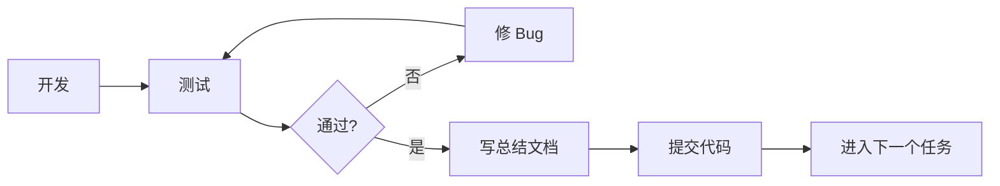

# Insight 项目 — 研发排期与任务分解

## 项目概述

基于 Elixir + Phoenix 1.8 + SQLite + LiveView + Tailwind v4，构建一个 AI 驱动的 HackerNews 智能阅读器。

> [!IMPORTANT]
> 每个任务完成后都会：(1) 编写总结文档 (2) 提交代码 (3) 进入下一个任务。遵循「开发 → 测试 → 修 Bug → 再测试 → 总结 → 提交」的闭环流程。

---

## 研发排期表

项目按**依赖关系**和**递增复杂度**排列，分为 6 个阶段、17 个任务。

| 阶段 | 任务编号 | 任务名称 | 对应需求 | 预计工作量 | 依赖 |
|------|---------|---------|---------|-----------|------|
| **一：基础设施** | T01 | 用户注册/登录/密码重置 | 需求 1 | ⭐⭐⭐ | 无 |
| | T02 | 数据库 Schema 设计（新闻 + 标签） | 需求 2/5 | ⭐⭐ | T01 |
| **二：爬虫核心** | T03 | HN 爬虫（抓取 + 分页 + 定时） | 需求 2 | ⭐⭐⭐ | T02 |
| **三：AI 智能层** | T04 | AI 集成基础（ReqLLM + Qwen） | 需求 19 | ⭐⭐ | T03 |
| | T05 | 自动标签 & 关键词提取 | 需求 5 | ⭐⭐⭐ | T04 |
| | T06 | AI 中文摘要 & 标题翻译 | 需求 6 | ⭐⭐ | T04 |
| **四：用户交互** | T07 | 新闻列表 & 分类查询 | 需求 3 | ⭐⭐ | T03 |
| | T08 | Like / Dislike 功能 | 需求 4 | ⭐⭐ | T07 |
| | T09 | 用户自定义标签管理 | 需求 2 | ⭐⭐ | T05 |
| | T10 | 已读状态标记 | 需求 14 | ⭐ | T07 |
| | T11 | 稍后再读 & 阅读历史 | 需求 13 | ⭐⭐ | T08, T10 |
| **五：个性化推荐** | T12 | 负向反馈 & 关键词屏蔽 | 需求 9 | ⭐⭐ | T08 |
| | T13 | 自定义阅读流 (Custom Feeds) | 需求 10 | ⭐⭐⭐ | T05, T12 |
| | T14 | 动态兴趣画像 & AI 推荐理由 | 需求 8, 11 | ⭐⭐⭐ | T08, T05 |
| | T15 | "Serendipity" 破圈推荐 | 需求 15 | ⭐⭐ | T14 |
| **六：高级功能** | T16 | 个人日报/周报 | 需求 12 | ⭐⭐⭐ | T14, T06 |
| | T17 | 技术雷达 & 上下文记忆 | 需求 16, 17 | ⭐⭐⭐⭐ | T14, T11 |

> [!NOTE]
> UI 设计（需求 18）不作为独立任务，而是贯穿每个任务。每个任务的前端部分都使用 LiveView + Tailwind v4 实现现代、通透的阅读体验。

---

## 各任务详细说明

### 阶段一：基础设施

---

#### T01 — 用户注册/登录/邮箱重置密码

**目标**：利用 `mix phx.gen.auth` 生成完整的用户认证系统。

**范围**：
- 运行 `mix phx.gen.auth Accounts User users` 生成认证脚手架
- 注册 / 登录 / 登出
- 邮箱重置密码（集成 Swoosh）
- 用 LiveView 美化认证页面 UI

**验证**：
- 运行 `mix test` — 生成器自带的认证测试全部通过
- 手动验证：注册新用户 → 登录 → 登出 → 重置密码流程

---

#### T02 — 数据库 Schema 设计（新闻 + 标签 + 用户交互表）

**目标**：设计并创建核心数据模型。采用三表爬取快照设计。

**范围**：

| 表名 | 关键字段 |
|------|---------|
| `news_items` | up_id (唯一), title, title_zh, url, domain, hn_user, summary_zh, keywords, posted_at |
| `crawl_snapshots` | source_type (news/newest), crawled_at, items_count |
| `crawl_snapshot_items` | crawl_snapshot_id, news_item_id, rank, score_at_crawl, comments_count_at_crawl |
| `tags` | name, type (system/user), user_id (nullable) |
| `news_tags` | news_item_id, tag_id |
| `user_interactions` | user_id, news_item_id, action (like/dislike/click/bookmark/read), duration_seconds |
| `blocked_items` | user_id, block_type (tag/domain/keyword), value |
| `custom_feeds` | user_id, name, rules (JSON) |
| `user_interest_profiles` | user_id, tag_id, weight, updated_at |

- 创建 migration 文件
- 创建对应的 Ecto Schema 和 Context 模块
- 在 `seeds.exs` 中写入系统默认标签

**验证**：
- `mix ecto.reset` 无报错
- 编写 Context 模块的基础 CRUD 单元测试

---

### 阶段二：爬虫核心

---

#### T03 — HN 爬虫（抓取 + 分页 + 定时任务）

**目标**：爬取 HN 首页和 Newest 页面，支持翻页（最多 300 条），整点定时执行。

**范围**：
- 使用 `Req` 库抓取 HTML
- 解析新闻列表（标题、URL、score、评论数、up_id 等）
- 支持通过 "More" 链接翻页，每种类型最多 300 条
- 请求间隔 10 秒
- 数据以 `up_id` 去重后入库
- 使用 `GenServer` + `:timer.send_interval` 实现整点定时
- 将爬虫添加到 Application supervisor tree

**验证**：
- 单元测试：HTML 解析逻辑
- 集成测试：手动运行一次爬取，检查数据库数据

---

### 阶段三：AI 智能层

---

#### T04 — AI 集成基础设施（ReqLLM + Qwen）

**目标**：搭建可复用的 AI 调用模块。

**范围**：
- 添加 `req_llm` 依赖
- 创建 `Insight.AI` 模块，封装 Qwen API 调用
- 配置 API Key（从环境变量读取）
- 实现通用的 prompt → response 调用接口
- 错误处理和重试机制

**验证**：
- 需用户提供 API Key 后进行集成测试
- 单元测试：mock API 响应的处理逻辑

---

#### T05 — 自动标签 & 关键词提取

**目标**：爬虫入库前通过 AI 自动打标签、提取关键词。

**范围**：
- 设计标签分类 Prompt（科技、AI、开源、融资 …）
- 调用 AI 分析标题和 URL，返回匹配的系统标签
- 提取 3-5 个核心关键词存入 `keywords` 字段
- 将标签关联关系写入 `news_tags` 表
- 爬虫流程中集成：抓取 → AI 标签 → 入库

**验证**：
- 单元测试：Prompt 构造和响应解析
- 集成测试：运行一次爬取，确认新闻自动打上标签

---

#### T06 — AI 中文摘要 & 标题翻译

**目标**：自动翻译标题，生成 50-100 字中文摘要。

**范围**：
- 设计翻译和摘要 Prompt
- 翻译英文标题 → `title_zh` 字段
- 生成中文摘要 → `summary_zh` 字段
- 批量处理和节流控制

**验证**：
- 检查数据库中 `title_zh` 和 `summary_zh` 均已填充
- 抽查翻译质量

---

### 阶段四：用户交互

---

#### T07 — 新闻列表 & 分类查询（LiveView）

**目标**：用户可按类型查看新闻，支持分页和实时更新。

**范围**：
- 创建 `NewsLive.Index` LiveView
- 按 source_type / 标签 筛选
- LiveView Streams 加载新闻列表
- 显示中文标题、摘要、标签、score
- 现代 UI：大留白、柔和阴影、信息层级

**验证**：
- LiveView 测试：页面渲染、筛选交互
- 浏览器验证：视觉效果和响应式布局

---

#### T08 — Like / Dislike 功能

**目标**：用户可对新闻点赞/踩。

**范围**：
- `user_interactions` 表写入 like/dislike 记录
- LiveView 中的按钮交互（微动画反馈）
- 一条新闻每个用户只能 like 或 dislike 一次
- 实时 UI 更新

**验证**：
- 单元测试：交互记录 CRUD
- LiveView 测试：按钮点击和状态切换

---

#### T09 — 用户自定义标签管理

**目标**：用户可创建/编辑/删除自定义标签。

**范围**：
- 标签管理页面（LiveView）
- 系统标签只读展示
- 用户标签 CRUD
- 手动给新闻添加/移除标签

**验证**：
- LiveView 测试：标签 CRUD 操作
- 权限验证：不能修改系统标签

---

#### T10 — 已读状态标记

**目标**：区分已读/未读，支持一键全部标记已读。

**范围**：
- `user_interactions` 中 action=read 记录
- 列表中已读/未读视觉区分
- "一键标记所有为已读" 按钮
- 点击新闻自动标记已读

**验证**：
- 单元测试：已读状态逻辑
- LiveView 测试：视觉区分和批量操作

---

#### T11 — 稍后再读 & 阅读历史

**目标**：收藏队列和完整浏览历史。

**范围**：
- action=bookmark 实现"稍后再读"
- 稍后再读列表页
- 阅读历史时间线（含 like/dislike 记录）
- 从队列中移除

**验证**：
- 单元测试：收藏和历史查询
- LiveView 测试：列表和时间线展示

---

### 阶段五：个性化推荐

---

#### T12 — 负向反馈 & 关键词屏蔽

**目标**：细粒度内容过滤控制。

**范围**：
- 屏蔽管理页面：按标签/域名/关键词
- `blocked_items` 表 CRUD
- 新闻列表查询时自动过滤被屏蔽内容
- 屏蔽规则即时生效

**验证**：
- 单元测试：过滤逻辑
- LiveView 测试：添加屏蔽后列表更新

---

#### T13 — 自定义阅读流 (Custom Feeds)

**目标**：用户可组合标签 + 条件创建专属 Tab。

**范围**：
- Custom Feed 创建/编辑页面
- 规则构建器（标签组合 + score 阈值 + 关键词）
- 动态查询引擎：根据 JSON 规则生成 Ecto 查询
- 在首页展示为独立 Tab

**验证**：
- 单元测试：规则解析和查询生成
- LiveView 测试：创建 Feed 并验证内容筛选

---

#### T14 — 动态兴趣画像 & AI 推荐理由

**目标**：隐式行为追踪 + AI 生成推荐语。

**范围**：
- 记录 click / 停留时长 / 收藏行为
- 定期更新 `user_interest_profiles` 权重
- AI 生成推荐语（"因为你最近点赞了…"）
- 基于兴趣画像的新闻排序

**验证**：
- 单元测试：权重计算算法
- 集成测试：模拟用户行为后验证画像更新

---

#### T15 — "Serendipity" 破圈推荐

**目标**：每天安插 1-2 篇兴趣范围外的高质量文章。

**范围**：
- 筛选高质量但用户兴趣范围外的新闻
- AI 生成"破圈推荐语"
- 在信息流中特殊展示（不同视觉样式）
- 控制频率：每天 1-2 篇

**验证**：
- 单元测试：选择算法
- 手动验证：确认推荐内容确实"破圈"

---

### 阶段六：高级功能

---

#### T16 — 个人日报/周报

**目标**：每天 9 点生成 AI 个人专属新闻简报。

**范围**：
- 定时任务：每天 9:00 触发
- 根据兴趣画像筛选新闻
- AI 排版总结生成日报
- 日报存储和历史查看
- 可选：邮件推送

**验证**：
- 单元测试：日报生成逻辑
- 手动运行一次生成，检查简报质量

---

#### T17 — 技术雷达 & 上下文记忆追踪

**目标**：个人阅读图谱 + 跨时间新闻关联。

**范围**：
- 统计用户阅读偏好分布
- 雷达图可视化（图表组件）
- 成就系统（"硅谷观察家" 等称号）
- Story Arc Tracker：AI 检索同一话题的历史新闻
- "还记得吗？" 提示组件

**验证**：
- 单元测试：统计和关联算法
- 浏览器验证：雷达图渲染和交互

---

## 执行流程

每个任务严格遵循以下流程：

## User Review Required

> [!IMPORTANT]
> **需要您确认以下事项：**
> 1. 已移除评论区相关任务（原 T04 评论区爬取 和 T08 AI 评论区观点提取），现共 **17 个任务**。排期是否满意？
> 2. 是否从 **T01（用户认证）** 开始执行？
> 3. AI 部分（T04-T06）需要您提供 **Qwen API Key**，在到达该阶段前请准备好。
> 4. 总结文档放在项目 `docs/` 目录下，是否可以？
